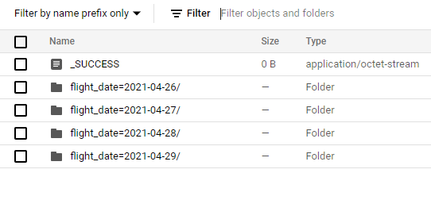
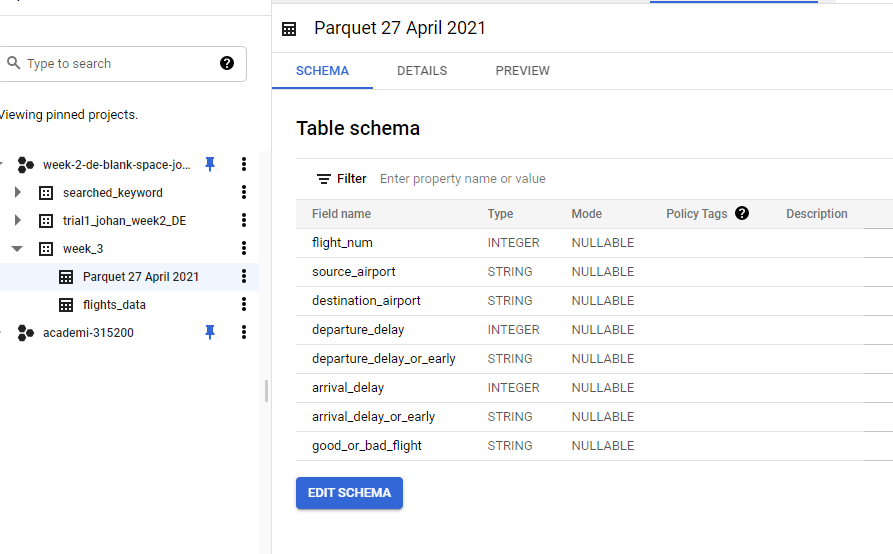

# Week-3-Dataproc-Sparkjob-Processing

Spark is a platform that provides analytics engine for data processing. 
It has built-in modules such as SQL, machine learning, streaming, and graph processing  
In this case, I will pyspark for creating a sparkjob to `transform` a data before loaded into the database  

### Requirements  
- GCP Account
- Google SDK (for running manually)
- Git Bash (for processing bash script)
- Pyspark

### Installation  
- Enable API for Dataproc in your GCP
- Clone this `https://github.com/Johanklemantan/Week-3-Dataproc-Sparkjob-Processing.git`

### How to Use  
- Change the variables `REGION, CLUSTER_NAME, BUCKET, PROJECT_ID, ZONE` as per your will 
- Open git bash, and change directory to the placed folder
- Type `bash bash_script.sh`
- Press Enter

### Script Explanation  
The task is basically is to transform filename and a value of one of it's column. 
So, basically for this I'm just using library `pandas, datetime,` and `os`. 

__Bash Script Explanation__

`mkdir data_output
gcloud config set project ${PROJECT_ID}
python transform_data.py`

This bash script is basicly just crete one new folder named 'data_output' that will store the output of transformed file 

`gsutil -m cp -r D:/DS/Academi/Week_3/Johan/data_output gs://week-3-johan/data`

Loading data into GCS  

`gcloud services enable compute.googleapis.com \
    dataproc.googleapis.com \
    bigquerystorage.googleapis.com`
    
Enabling API for dataproc

`gcloud beta dataproc clusters create ${CLUSTER_NAME} \
  --region=${REGION} \
  --zone=${ZONE} \
  --single-node \
  --master-machine-type=n1-standard-2 \
  --bucket=${BUCKET_NAME} \
  --image-version=1.5-ubuntu18 \
  --optional-components=ANACONDA,JUPYTER \
  --enable-component-gateway \
  --metadata 'PIP_PACKAGES=google-cloud-bigquery google-cloud-storage' \
  --initialization-actions gs://goog-dataproc-initialization-actions-${REGION}/python/pip-install.sh`
  
Creating Dataproc Cluster with certain specification

`gcloud dataproc jobs submit pyspark \
    gs://week-3-johan/sparkjob/sparkjob1.py \
  --cluster=${CLUSTER_NAME} \
  --region=${REGION} \
  --jars=gs://spark-lib/bigquery/spark-bigquery-latest_2.12.jar`
  
Submit sparkjob to bigquery 
In my sparkjob, I am creating a label for flights that is delay or too early. Then I put a label for this flights, whether this flight is a good or a bad flights. 
For further details, you can go into my file `sparkjob1.py`

`gcloud dataproc clusters delete dataproc-johan-week3 --region=us-central1`

Deleting Cluster for the sake of saving billings.

#### Output
So, the output of this project is a bigquery table consist of the transformed file of flights data. 
For the extra milestone, I tried to save this file in parquet file type to save some memory and also I add `partition` to flight_date to make users(analytics team) to query this file faster and save some costs.  
Here is the output of parquet files that stores in my GCS account : 
 

Here is after I tried to read the parquet file in the BigQuery: 
 

#### Thankyou and Happy Coding
